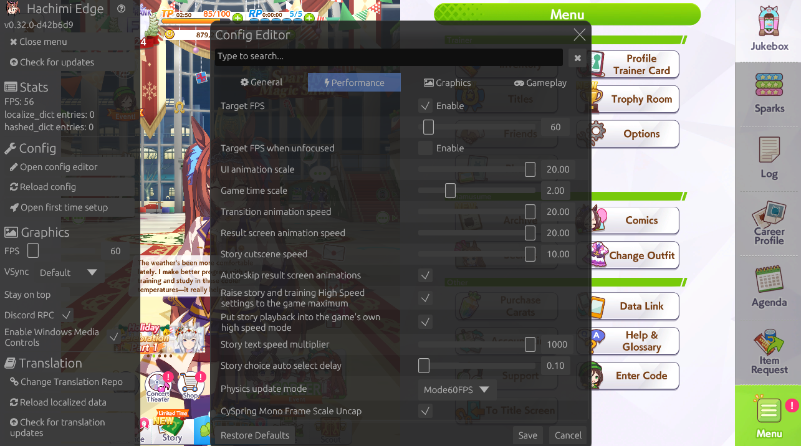

# Hachimi Edge (performance fork)

English | [简体中文](README-zh_cn.md) | [繁體中文](README-zh_tw.md)

[](https://discord.gg/YjBgmuqqYr)

Game enhancement and translation mod for UM:PD, forked to make the game **take less time and cost less to run**.

This fork tracks upstream Hachimi Edge (currently merged up to v0.32.0) and keeps every upstream feature. It adds a set of opt in speed options, faster startup, and a measurement first approach: every change is checked against logged game runs, not against feel.



> [!NOTE]
> The Chinese READMEs are upstream's and do not describe the fork additions yet.

# ⚠️ Please don't link to this repo or Hachimi's website
We understand that you want to help people install Hachimi and have a better experience playing the game. However, this project is inherently against the game's TOS and The Game Developer most definitely wants it gone if they were ever to learn about it.

While sharing in your self-managed chat services and through private messaging is fine, we humbly ask that you refrain from sharing links to this project on public facing sites, or to any of the tools involved.

Or share them and ruin it for the dozens of Hachimi users. It's up to you.

### If you're going to share it anyways
Do what you must, but we would respectfully request that you try to label the game as "UM:PD" or "The Honse Game" instead of the actual name of the game, to avoid search engine parsing.

# What this fork adds

### Performance tab
The Config Editor has a new **Performance** tab that groups every speed and frame option in one place. Every option this fork adds is **off by default** (`1.0` or unchecked) and does nothing until you turn it on.

| Option | What it does | Range |
|---|---|---|
| Transition animation speed | Shortens screen to screen fades, wipes and loading overlays by scaling the game's own fade durations. | 1x to 20x |
| Result screen animation speed | Shortens training plates, count ups and result screen reward cascades. | 1x to 20x |
| Story cutscene speed | Speeds up the story timeline through the game's own time scale helpers. | 1x to 10x |
| Auto-skip result screen animations | Presses the game's own skip on result screens as soon as it becomes available. | on / off |
| Raise High Speed settings to the game maximum | Raises the story and training High Speed settings through the game's own save path, once per value. | on / off |
| Put story playback into high speed mode | Turns on the game's built in story high speed mode. | on / off |
| Game time scale | Scales `Time.timeScale`. This affects the whole game, so the duration options above are the preferred tool. | 1x to 5x |

The tab also gathers the existing upstream options that affect speed and frame cost: UI animation scale (now capped at 20x), target FPS, target FPS when unfocused, story text speed, story choice auto select delay, physics update mode and CySpring frame scale uncapping.

### Built to be safe at speed
- **Hard limits in code.** Speed factors are capped at 20x and time scale at 5x, whatever `config.json` says, so a typo can't break a screen.
- **No compounding.** Every value is computed from the game's original, never from the current value, so applying a setting twice or moving a slider back and forth never stacks.
- **Presentation only.** Speed options act on animation timings and the game's own settings. They never skip server calls, change race simulation, or touch purchases or saves.
- **Signature checked hooks.** Speed hooks only attach when a method's parameter and return types match exactly. A method that changed in a game update is skipped and logged instead of crashing.
- **Unresolved targets stay inert.** Calls through a method the mod could not find are refused instead of crashing the game.

### Faster startup
Hooks are now created first and armed in a single pass. Arming used to take about **4.7 s** of every launch (24 ms per hook). Across later runs it took **0.05 to 0.08 s** for about 190 hooks.

### Diagnostics
- With `enable_file_logging` on, every run writes a **config snapshot** line with the timing settings it used, plus a log line the first time each speed hook is actually reached.
- `debug_mode` writes the game's own class, method and field names to `introspect.log`. It also turns on observe only probes for the story playback paths.
- The [defect ledger](DEFECTS.md) records every measured run, known issue and fix in order.

# Features (from upstream)
- **High quality translations:** Hachimi comes with advanced translation features that help translations feel more natural (plural forms, ordinal numbers, etc.) and prevent introducing jank to the UI. It also supports translating most in-game components; no manual assets patching needed!

    Supported components:
    - UI text
    - master.mdb (skill name, skill desc, etc.)
    - Race story
    - Main story/Home dialog
    - Lyrics
    - Texture replacement
    - Sprite atlas replacement

    Additionally, Hachimi does not provide translation features for only a single language; it has been designed to be fully configurable for any language.

- **Easy setup:** Just plug and play. All setup is done within the game itself, no external application needed.
- **Translation auto update:** Built-in translation updater lets you play the game as normal while it updates, and reloads it in-game when it's done, no restart needed!
- **Built-in GUI:** Comes with a config editor so you can modify settings without even exiting the game!
- **Graphics settings:** You can adjust the game's graphics settings to make full use of your device's specs, such as FPS unlocking and resolution scaling.
- **Custom fonts:** Load a standalone `.hachifont` font pack without patching game assets.
- **Cross-platform:** Designed from the ground up to be portable, with Windows and Android support.

# Installation
For upstream Hachimi Edge, see the [Getting started](https://hachimi.noccu.art/docs/hachimi/getting-started.html) page.

For this fork (Windows, Steam, Global client):

1. Download `hachimi-edge-<version>-windows.zip` from this repository's **Releases** page.
2. Close the game and copy `cri_mana_vpx.dll` from the zip into the game's root folder, next to the game executable.
3. Start the game and open the Config Editor. The speed options are on the **Performance** tab.

Releases are currently **pre-releases**. This fork is developed and measured on the Windows Steam Global client. Android builds compile, but have not been tested on a device.

# Building
```bash
cargo build --release
```
The Windows DLL is written to `target/release/hachimi.dll`. Rename it to `cri_mana_vpx.dll` to deploy it. Before sending changes, run `cargo test --lib` and clippy with `-D warnings` for both `x86_64-pc-windows-msvc` and `aarch64-linux-android`. See [AGENTS.md](AGENTS.md) for the contributor guide, including the Android toolchain setup on a Windows host.

# Special thanks
These projects have been the basis for Hachimi's development; without them, Hachimi would never have existed in its current form:

- [Hachimi Edge](https://github.com/kairusds/Hachimi-Edge), the upstream this fork tracks
- [Trainers' Legend G](https://github.com/MinamiChiwa/Trainers-Legend-G)
- [umamusume-localify-android](https://github.com/Kimjio/umamusume-localify-android)
- [umamusume-localify](https://github.com/GEEKiDoS/umamusume-localify)
- [Carotenify](https://github.com/KevinVG207/Uma-Carotenify)
- [umamusu-translate](https://github.com/noccu/umamusu-translate)
- [frida-il2cpp-bridge](https://github.com/vfsfitvnm/frida-il2cpp-bridge)

# License
[GNU GPLv3](LICENSE)
